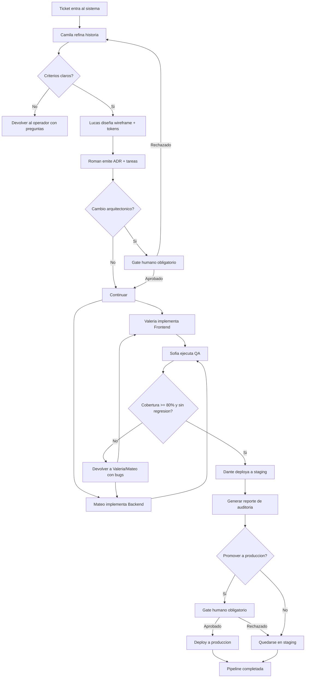
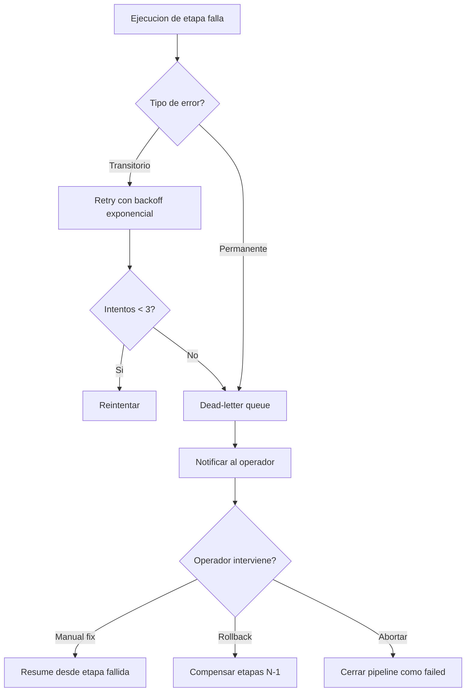
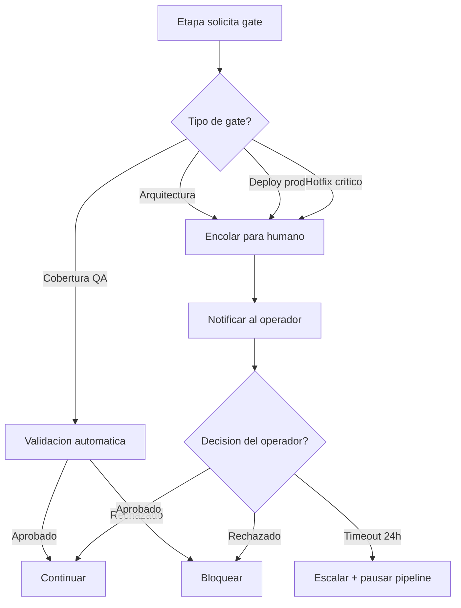
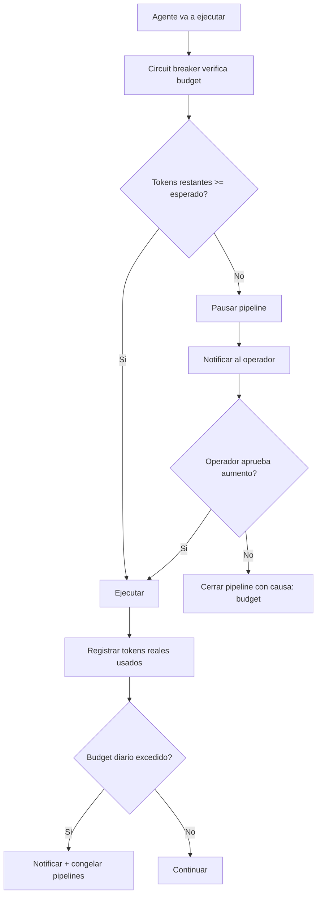
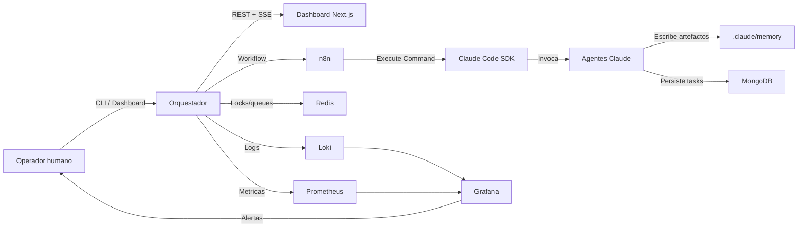
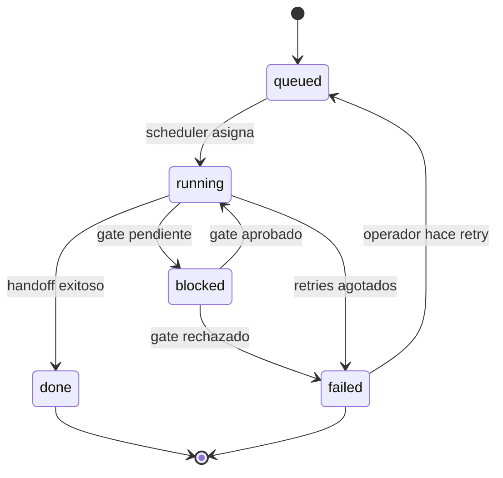

# Flujogramas del Orquestador Autonomo

## 1. Flujo principal end-to-end

## 2. Flujo de manejo de fallas

## 3. Flujo de gates

## 4. Flujo de presupuesto de tokens

## 5. Arquitectura de componentes

## 6. Ciclo de vida de una task

